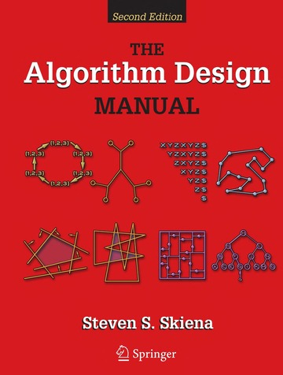

# The Algorithm Design Manual

# Why I am reading this book?

I'm reading this book to learning more about data structure and develop my algorithms.

# Progress
I put the file name with rule: chapter_part_theExerciseNumber. So you can understand 1.7.1 is exercise 1, part 1.7 in chapter 1.

**Chapter 1**: Done exercise 1-20

**Chapter 2**: Done exercise 2-24